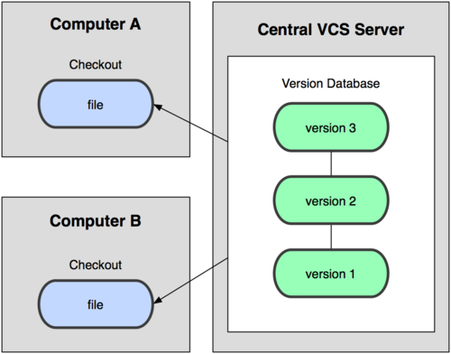

!SLIDE center

# Intro to Git #
## Distributed Version Control ##
Scott Becker, Dev Tools / Jive Apps Framework 

!SLIDE bullets

# About Version Control #

* Record changes to file(s)
* Compare changes over time
* Revert to a previous state

!SLIDE bullets smaller

# 1.0: DIY Version Control #

* Simply copy files into another directory (bonus: timestamped)
* Easy to screw up: 
* forget which directory you're in
* accidentally write over or copy the wrong file

!SLIDE bullets smaller

# 2.0: Local Version Control #

* RCS: Still distributed today
* Keeps patch sets (differences between files) 
* Re-create what any file looked like by adding up all the patches

!SLIDE center

# 2.0: Local Version Control #

All local, all the time

!SLIDE bullets smaller

# 3.0: Centralized Version Control #

* Subversion: Still widely used
* Addresses need to collaborate with others
* Single server contains all versioned files
* All clients check out files from that single place

!SLIDE center

# 3.0: Centralized Version Control #

One server, one repository, many clients, many checkouts

!SLIDE bullets smaller

# Centralized Disadvantages #

* Single point of failure
* Entire history in a single place
* Server down? Can't make commits or share changes
* Disk corruption without proper backups? Lose all history

!SLIDE bullets smaller

# 4.0: Distributed Version Control #

* Git, Mercurial, Bazaar, Darcs
* Clients don't check out just the latest snapshot
* Each checkout is a full mirror of the repository
* If a server dies, any client repository could be used to restore

!SLIDE center smaller

# 4.0: Distributed Version Control #

One repository per client or server

!SLIDE bullets smaller

# Distributed Advantages #

* Flexible: Many possible workflows possible
* No Single Point of Failure
* Work Offline

!SLIDE bullets smaller

# History of Git #

* 2002-2005: Linux kernel used a proprietary DCVS called BitKeeper
* 2005: Relationship between BitKeeper and community broke down
* Linux community (starting with Linus Torvalds) created their own tool

!SLIDE bullets smaller

# Goals of Git #

* Speed
* Simple design
* Strong support for non-linear development (1000s of parallel branches)
* Fully distributed
* Able to handle large projects, such as the Linux Kernel
