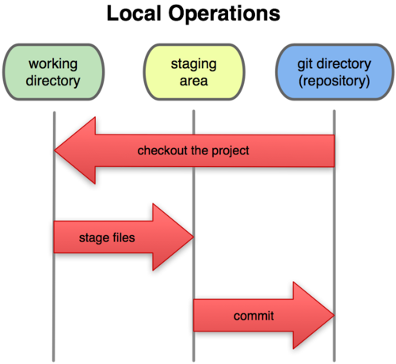

!SLIDE bullets

# Basics of Git #

* Snapshots, not differences
* Nearly every operation is local
* Git has integrity (checksums)
* Git generally only adds data

!SLIDE bullets

# Three file states #

* Committed - latest version is stored
* Modified  - latest version is different
* Staged    - latest version is different, and marked to go into the next commit

!SLIDE bullets

# Three main sections in repo #

* Git directory     - Git's metadata and database - the repository 
* Working directory - Single checkout of one version of the project
* Staging area      - Stores information about what will go in your next commit

!SLIDE bullets incremental

# Basic Git Workflow #

* Modify files in your working directory
* Stage the files for commit
* Do a commit - takes the files as they are in the staging area and stores a snapshop permanently in Git

!SLIDE center

